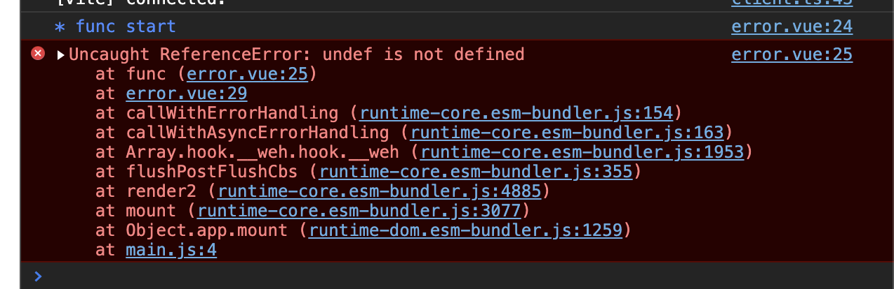
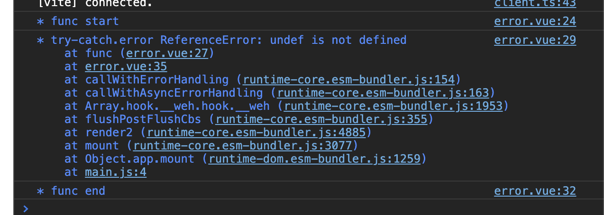
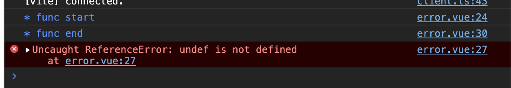
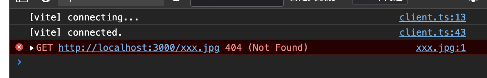
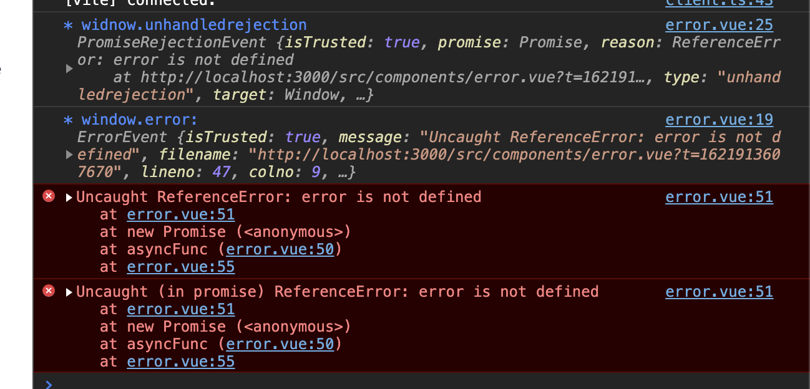
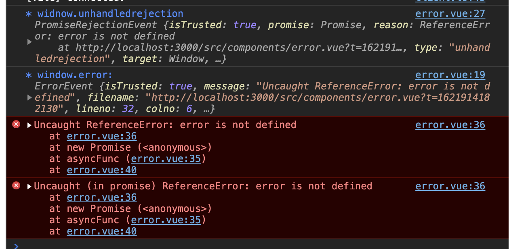

## 生成同步的错误

* 主动使用未定义的变量`undef`
* 报错了
* 阻塞(后续代码的执行)

```js
const func = () => {
  console.debug('* func start');
  undef;
  console.debug('* func end');
};

func();
```



## 增加 try-catch

* 报错被`try-catch`捕获
* 会拦截错误
* 不会阻塞(后续代码的执行)

```js
// ...
try {
  undef;
} catch (error) {
  console.debug('* try-catch.error', error);
}
// ...
```



::: tip
`try-catch` 不能捕获异步错误; 
(await+Promise 形式能捕获)
:::

## 产生异步错误

* `try-catch`不能捕获异步错误

```js
// ...
setTimeout(() => {
  undef;
}, 1000);
// ...
```



## 资源加载失败错误

* `try-catch`不能捕获资源加载类型错误

```js
// ...
/* 动态创建image; 赋值不存在的资源; 插入DOM中 */
const image = new Image();
image.src = 'no-exist.jpg';
document.querySelector('#app').insertBefore(image, null);
// ...
```



## 全局error事件

## window.onerror = function()

* 能捕获异步类型的错误
* 不能捕获资源加载错误
* 参数是: 内容|string, 所在文件, 行数, 列数, 内容|object

```js
// ...
window.onerror = function(...args) {
  console.debug('* window.onerror: ', args);
};
// ...
```


## window.addEventListener('error', 回调函数[, 冒泡标识])

* "异步错误" 和 "资源加载错误" 都能捕获; 
* 参数是一个错误对象`ErrorEvent`; 
* 不能屏蔽错误(会继续打印到控制台上); 

```js
// ...
window.addEventListener(
  'error',
  (...args) => {
    console.debug('* window.onerror: ', ...args);
  },
  true /* 标识: 捕获阶段 */
);
// ...
```


## Promsise 类型的错误

## 普通Promise对象
* `window.addEventListener('error')`不能捕获 Promise 错误
* `window.addEventListener('unhandledrejection')`能捕获 Promise 错误

```js
// ...
window.addEventListener(
  'unhandledrejection',
  (...args) => {
    console.debug('* widnow.unhandledrejection', ...args);
  },
  true
);

const asyncFunc = () =>
  new Promise((res) => {
    error;
  });

setTimeout(() => {
  asyncFunc();
}, 100);
// ...
```


* `unhandledrejection`事件捕获到的错误, 主动抛出, 被`error`事件捕获

```js
// ...
window.addEventListener(
  'error',
  (event) => {
    console.debug('* window.error: ', event);
  },
  true
);

window.addEventListener(
  'unhandledrejection',
  (event) => {
    console.debug('* widnow.unhandledrejection', event);
    /* 再次抛出错误 */
    throw event.reason;
  },
  true
);
// ...
```



## async-await

* 能被`unhandledrejection`捕获

```js
  setTimeout(async () => {
    await asyncFunc();
  }, 100);
```

  

* `async-await`错误, 还能被`try-catch`捕获
* 屏蔽错误

```js
// ...
setTimeout(async () => {
  try {
    await asyncFunc();
  } catch (error) {
    console.debug('* try-catch.async: ', error);
  }
}, 100);
// ...
```

.png>)

## iframe 错误

```js
window.frames[0].onerror = (err) => {
  console.debug('* frames.onerror:', err);
};

setTimeout(() => {
  const iframe = document.createElement('iframe');
  iframe.src = `./iframe.html`;
  document.body.insertBefore(iframe, null);
}, 1000);
```
